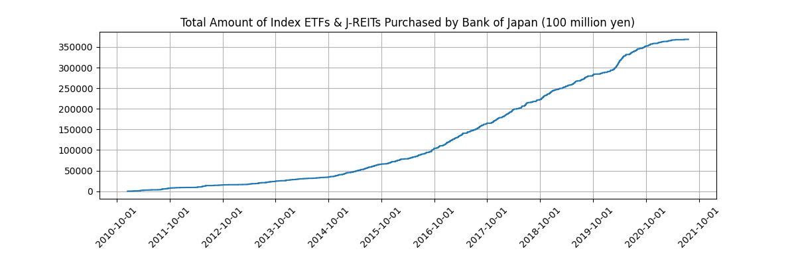

# Index ETFs & J-REITs Purchased by Bank of Japan

Download [CSV data](data/processed/boj_etf_reit_amount.csv).

## Data Description

| Name          | Description                                                            | Example    | Has Missing |
|---------------|------------------------------------------------------------------------|------------|-------------|
| Date          | Trade date                                                             | 2021-01-02 | No          |
| IndexETF      | Purchases of ETFs other than those mentioned in `SupportiveETF` column | 501.0      | Yes         |
| SupportiveETF | Purchases of ETFs to support investment in physical and human capital  | 12.0       | Yes         |
| J-REIT        | Purchases of Japan's real estate investment trust (J-REIT)             | 12.0       | Yes         |
| LendingETF    | New lending of ETFs                                                    | 11.0       | Yes         |

All amounts are recorded in units of 100 million yen.

## DISCLAIMER
The accuracy of the processed data is not guaranteed. Use at your own risk.

The copyright of the original data belongs to [the Bank of Japan](https://www.boj.or.jp/en/index.htm/).
